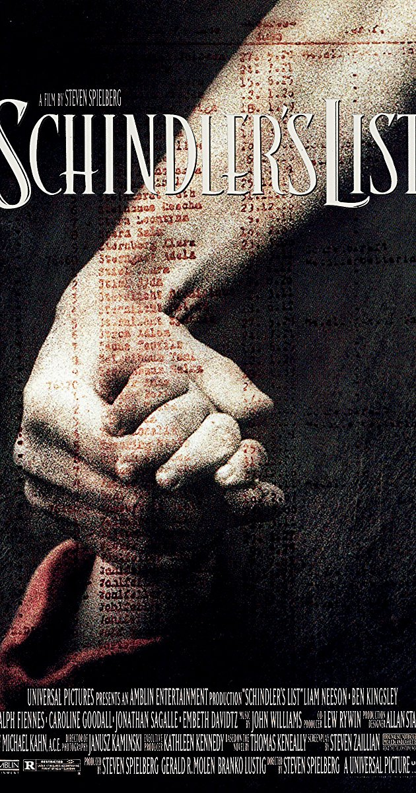
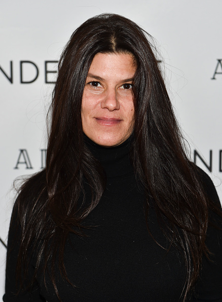

```{r, message=FALSE, warning=FALSE}
library(mdsr)
library(RMySQL)
db <- dbConnect_scidb(dbname = "imdb")

library(tidyverse)
library(ggthemes)
library(RColorBrewer)
```

```{r, message=FALSE, warning=FALSE}
top_10_Movies <- "
SELECT t.title, cast.note, name_cast.name, name_cast.gender
FROM title t
JOIN movie_info_idx AS mi1 ON mi1.movie_id = t.id
JOIN movie_info_idx AS mi2 ON mi2.movie_id = t.id
JOIN cast_info as cast on cast.movie_id = t.id
join name as name_cast on name_cast.id = cast.person_id
WHERE t.kind_id = 1 
  AND mi1.info_type_id = 100
  AND mi2.info_type_id = 101
  AND mi1.info > 100000
  and cast.role_id in (3, 4, 8)
  group by t.title
ORDER BY mi2.info desc
LIMIT 10;
"
db %>%
  dbGetQuery(top_10_Movies)
```





```{r}
bottom_10_Movies <- 
"
SELECT t.title, cast.note, name_cast.name, name_cast.gender
FROM title t
JOIN movie_info_idx AS mi1 ON mi1.movie_id = t.id
JOIN movie_info_idx AS mi2 ON mi2.movie_id = t.id
JOIN cast_info as cast on cast.movie_id = t.id
join name as name_cast on name_cast.id = cast.person_id
WHERE t.kind_id = 1 
  AND mi1.info_type_id = 100
  AND mi2.info_type_id = 101
  AND mi1.info > 100000
  and cast.role_id in (3, 4, 8)
  group by t.title
ORDER BY mi2.info
LIMIT 10;
"
db %>%
  dbGetQuery(bottom_10_Movies)
```

```{r, message=FALSE, warning=FALSE}
# movie <-function(title){
#   paste(
# "
# SELECT t.title, cast.note, name_cast.name, name_cast.gender
# FROM title t
# JOIN movie_info_idx AS mi1 ON mi1.movie_id = t.id
# JOIN movie_info_idx AS mi2 ON mi2.movie_id = t.id
# JOIN cast_info as cast on cast.movie_id = t.id
# join name as name_cast on name_cast.id = cast.person_id
# WHERE t.title =","'",title,"'",
#   "AND mi1.info_type_id = 100
#   AND mi2.info_type_id = 101
#   AND mi1.info > 100000
#   and cast.role_id  in (3, 4, 8);", sep = ""
# )
# }
# 
# Shawshank_Redemption <- movie("The Shawshank Redemption")
# 
# Godfather <- movie("The Godfather")
# 
# Dark_Knight <- movie("The Dark Knight")
# 
# Godfather_PartII <- movie("The Godfather: Part II")
# 
# Angry_Men <- movie("12 Angry Men")
# 
# Il_buono <- movie("Il buono,\n il brutto,\n il cattivo")
# 
# Pulp_fiction <- movie("Pulp Fiction")
# 
# Schindler_list <- "
# SELECT *
# FROM title t
# JOIN movie_info_idx AS mi1 ON mi1.movie_id = t.id
# JOIN movie_info_idx AS mi2 ON mi2.movie_id = t.id
# JOIN cast_info as cast on cast.movie_id = t.id
# join name as name_cast on name_cast.id = cast.person_id
# WHERE t.title LIKE '%Schindler%'
#   AND mi1.info_type_id = 100
#   AND mi2.info_type_id = 101
#   AND mi1.info > 100000
#   and cast.role_id  in (3, 4, 8);
# "
# 
# Lord_of_the_Rings <- movie("The Lord of the Rings:\nThe Return of the King")
# 
# Fight_club <- movie("Fight Club")
# 
# 
# db %>%
#   dbGetQuery(Shawshank_Redemption)
# 
# db %>%
#   dbGetQuery(Godfather)
# 
# db %>%
#   dbGetQuery(Dark_Knight)
# 
# db %>%
#   dbGetQuery(Godfather_PartII)
# 
# db %>%
#   dbGetQuery(Angry_Men)
# 
# db %>%
#   dbGetQuery(Il_buono)
# 
# db %>%
#   dbGetQuery(Pulp_fiction)
# 
# db %>%
#   dbGetQuery(Schindler_list)
# 
# db %>%
#   dbGetQuery(Lord_of_the_Rings)
# 
# db %>%
#   dbGetQuery(Fight_club)

```
```{r}
# # creating a data frame about top 10 movies
# 
# producer = c("Liz Glotzer", "Robert Evans", "Kevin De La Noy", "Francis Ford Coppola", "Henry Fonda", "Alberto Grimaldi", "Lawrence Bender", "Irving Glovin", "Peter Jackson", "Ross Grayson Bell")
# 
# sex_production = c("female", "male", "male", "male", "male", "male", "male", "male", "male", "male")
# 
# race = c("white", "white", "white", "white", "white", "white", "white", "white", "white", "white")
# 
# 
# # creating a data frame for The Shawshank Redemption
# 
# shaw_role = c("executive producer", "executive producer", "producer", "screenplay","story by", "director")
# 
# shaw_people = c("Liz Glotzer", "David Lester", "Niki Marvin", "Frank Darbont", "Stephen King", "Frank Darabont")
# 
# shaw_race = c("white", "white", "white", "white", "white", "white")
# 
# shaw_gender = c("female", "male", "female", "male", "male", "male")
# 
# 
# # creating a data frame for The Godfather
# 
# godFather_role = c("executive producer", "associate producer", "producer", "screenplay", "story by", "screenplay", "director")
# 
# godFather_people = c("Robert Evans", "Gray Frederickson", "Albert Ruddy", "Francis Ford Coppola", "Mario Puzo", "Mario Puzo", "Francis Ford Coppola")
# 
# godFather_race = c("white", "white", "white", "white", "white", "white", "white" )
# 
# godFather_gender = c("male", "male", "male", "male", "male", "male", "male" )
# 
# 
# # creating a data frame for The Dark Knight
# Dark_Knight_role = c("executive producer", "associate producer", "line producer: Hong Kong", "executive producer", "producer", "producer IMAX version", "producer", "producer", "executive producer", "executive producer", "story", "characters", "screenplay", "story", "screenplay", "director")
# 
# Dark_Knight_people = c("Kevin De La Noy", "Jordan Goldberg", "Philip Lee", "Benjamin Melniker", "Christopher Nolan", "Lorne Orleans", "Charles Roven", "Emma Thomas", "Thomas Tull", "Michael Uslan", "David Goyer", "Bob Kane", "Christopher Nolan", "Christopher Nolan", "Jonathan Nolan", "Christopher Nolan")
# 
# Dark_Knight_race = c("white", "white", "asian", "white", "white", "white", "white", "white", "white", "white", "white", "white", "white", "white", "white", "white")
# 
# Dark_Knight_gender = c("male", "male", "male", "male", "male", "male", "male", "female", "male", "male", "male", "male", "male", "male", "male", "male" )
# 
# # creating a data frame for The Godfather: Part II
# 
# god2_role = c("producer", "executive producer", "co-producer", "co-producer", "associate producer", "screenplay", "story by", "screenplay", "director")
# 
# god2_people = c("Francis Ford Coppola", "Robert Evans", "Gray Frederickson", "Fred Roos", "Mona Skager", "Francis Ford Coppola", "Mario Puzo", "Mario Puzo", "Francis Ford Coppola")
# 
# god2_race = c("white", "white", "white", "white", "white", "white", "white", "white","white")
# 
# god2_gender = c("male", "male", "male", "male", "female", "male", "male", "male", "male")
# 
# 
# # creating a data frame for the 12 Angry Men
# 
# Angry_role = c("producer", "associate producer", "producer", "screenplay", "story", "director")
# 
# Angry_people = c("Henry Fonda", "George Justin", "Reginald Rose", "Reginald Rose", "Reginald Rose", "Sidney Lumen")
# 
# Angry_race = c("white", "white", "white", "white", "white", "white")
# 
# Angry_gender = c("male", "male", "male", "male", "male", "male")
# 
# 
# # creating a data frame for Il buono,\n il brutto,\n il cattivo
# 
# il_role = c("producer", "screenplay as Age", "English version", "screensplay", "story", "screenplay as Scarpelli", "screenplay", "story", "director")
# 
# il_people = c("Alberto Grimaldi", "Agenore Incrocci", "Mickey Knox", "Sergio Leone", "Sergio Leone", "Furio Scarpelli", "Luciano Vincenzoni", "Luciano Vincenzoni", "Sergio Leone")
# 
# il_race = c("white", "white", "white", "white", "white", "white", "white", "white", "white")
# 
# il_gender = c("male", "male", "male", "male", "male", "male", "male", "male", "male")
# 
# 
# #creating a data frame for Pulp Fiction
# 
# pulp_role = c("producer", "executive producer", "co-executive producer", "executive producer", "executive producer", "co-executive producer", "co-executive producer", "story by", "story by", "written by", "director")
# 
# pulp_people = c("Lawrence Bender", "Danny DeVito", "Richard Gladstein", "Michael Shamberg", "Stacey Sher", "Bob Weinstein", "Harvey Weinstein", "Roger Avary", "Quentin Tarantino", "Quentin Tarantino", "Quentin Tarantino")
# 
# pulp_race = c("white", "white", "white", "white", "white", "white", "white", "white","white", "white", "white")
# 
# pulp_gender = c("male", "male", "male", "male", "female", "male", "male", "male", "male", "male", "male")
# 
# 
# # creating a data frame for Schindler's List
# 
# schindler_role = c("associate producer", "executive producer", "producer", "producer", "associate producer", "co-producer", "producer", "book", "screenplay", "director")
# 
# schindler_people = c("Irving Glovin", "Kathleen Kennedy", "Branko Lustig", "Gerald Molen", "Robert Raymond", "Lew Rywin", "Steven Spielberg", "Thomas Keneally", "Steven Zaillian", "Steven Spielberg")
# 
# schindler_race = c("white", "white", "white", "white", "white", "white", "white", "white", "white", "white")
# 
# schindler_gender = c("male", "female", "male", "male", "male", "male", "male", "male", "male", "male")
# 
# 
# # creating a data frame for The Lord of the Rings:\nThe Return of the King
# 
# lord_role = c("producer", "executive producer", "executive producer", "producer", "co-producer", "co_producer", "executive producer", "producer", "executive producer", "executive producer", "screenplay", "screenplay", "story by", "screenplay", "director")
# 
# lord_people = c("Peter Jackson", "Michael Lynne", "Mark Ordesky", "Barrie Osborne", "Rick Porras", "Jamie Selkirk", "Robert Shaye", "Fran Walsh", "Bob Weinstein", "Harvey Weinstein", "Philippa Boyens", "Peter Jackson", "J.R.R. Tolkien", "Fran Walsh", "Peter Jackson")
# 
# lord_race = c("white", "white", "white", "white", "latino", "white", "white", "white", "white", "white", "white", "white", "white", "white", "white")
# 
# lord_gender = c("male", "male", "male", "male", "male", "male", "male", "female", "male", "male", "female", "male", "male", "female", "male")
# 
# 
# # creating a data frame for Fight Club
# 
# fight_role = c("producer", "producer", "associate producer", "producer", "executive producer", "story by", "screenplay", "director")
# 
# fight_people = c("Ross Grayson Bell", "Cean Chaffin", "John Dorsey", "Art Linson", "Arnon Milchan", "Chuck Palahniuk", "Jim Uhls", "David Fincher")
# 
# fight_race = c("white", "white", "white", "white", "white", "white", "white", "white")
# 
# fight_gender = c("male", "female", "male", "male", "male", "male", "male", "male")
# ```
# 
# ```{r}
# # all of the data frames that was created from the top 10 highest rated movies
# top_10_Movie_DataFrame = data_frame(producer, sex_production, race)
# 
# Shawshank_Redemption_Cast = data_frame(shaw_role, shaw_people, shaw_race, shaw_gender)
# 
# godFather_Cast = data_frame(godFather_role, godFather_people, godFather_race, godFather_gender)
# 
# Dark_Knight_Cast = data_frame(Dark_Knight_role, Dark_Knight_people, Dark_Knight_race, Dark_Knight_gender)
# 
# Godfather_PartII_Cast = data_frame(god2_role, god2_people, god2_race, god2_gender)
# 
# Angry_Men_Cast = data_frame(Angry_role, Angry_people, Angry_race, Angry_gender)
# 
# Il_buono_Cast = data_frame(il_role, il_people, il_race, il_gender)
# 
# Pulp_fiction_Cast = data_frame(pulp_role, pulp_people, pulp_race, pulp_gender)
# 
# Schindler_list_Cast = data_frame(schindler_role, schindler_people, schindler_race, schindler_gender)
# 
# Lord_of_the_Rings_Cast = data_frame(lord_role, lord_people, lord_race, lord_gender)
# 
# Fight_club_Cast = data_frame(fight_role, fight_people, fight_race, fight_gender)

```

```{r, message=FALSE, warning=FALSE}
all_movies = c("Shawshank Redemption", "Shawshank Redemption","Shawshank Redemption","Shawshank Redemption","Shawshank Redemption","Shawshank Redemption","The Godfather","The Godfather","The Godfather","The Godfather","The Godfather","The Godfather","The Godfather", "The Dark Knight", "The Dark Knight","The Dark Knight","The Dark Knight","The Dark Knight","The Dark Knight","The Dark Knight","The Dark Knight","The Dark Knight","The Dark Knight","The Dark Knight","The Dark Knight","The Dark Knight","The Dark Knight","The Dark Knight","The Dark Knight", "The Godfather: Part II","The Godfather: Part II","The Godfather: Part II","The Godfather: Part II","The Godfather: Part II","The Godfather: Part II","The Godfather: Part II","The Godfather: Part II","The Godfather: Part II", "12 Angry Men", "12 Angry Men", "12 Angry Men", "12 Angry Men", "12 Angry Men", "12 Angry Men", "Il buono,\n il brutto,\n il cattivo","Il buono,\n il brutto,\n il cattivo","Il buono,\n il brutto,\n il cattivo","Il buono,\n il brutto,\n il cattivo","Il buono,\n il brutto,\n il cattivo","Il buono,\n il brutto,\n il cattivo","Il buono,\n il brutto,\n il cattivo","Il buono,\n il brutto,\n il cattivo","Il buono,\n il brutto,\n il cattivo", "Pulp Fiction","Pulp Fiction","Pulp Fiction","Pulp Fiction","Pulp Fiction","Pulp Fiction","Pulp Fiction","Pulp Fiction","Pulp Fiction","Pulp Fiction","Pulp Fiction", "Schindler's List","Schindler's List","Schindler's List","Schindler's List","Schindler's List","Schindler's List","Schindler's List","Schindler's List","Schindler's List","Schindler's List", "The Lord of the Rings:\nThe Return of the King","The Lord of the Rings:\nThe Return of the King","The Lord of the Rings:\nThe Return of the King","The Lord of the Rings:\nThe Return of the King","The Lord of the Rings:\nThe Return of the King","The Lord of the Rings:\nThe Return of the King","The Lord of the Rings:\nThe Return of the King","The Lord of the Rings:\nThe Return of the King","The Lord of the Rings:\nThe Return of the King","The Lord of the Rings:\nThe Return of the King","The Lord of the Rings:\nThe Return of the King","The Lord of the Rings:\nThe Return of the King","The Lord of the Rings:\nThe Return of the King","The Lord of the Rings:\nThe Return of the King","The Lord of the Rings:\nThe Return of the King", "Fight Club","Fight Club","Fight Club","Fight Club","Fight Club","Fight Club","Fight Club","Fight Club")

all_roles = c("executive producer", "executive producer", "producer", "screenplay","story by", "director", "executive producer", "associate producer", "producer", "screenplay", "story by", "screenplay", "director", "executive producer", "associate producer", "line producer: Hong Kong", "executive producer", "producer", "producer", "producer", "producer", "executive producer", "executive producer", "story by", "characters", "screenplay", "story by", "screenplay", "director", "producer", "executive producer", "co-producer", "co-producer", "associate producer", "screenplay", "story by", "screenplay", "director", "producer", "associate producer", "producer", "screenplay", "story by", "director", "producer", "screenplay", "English version", "screenplay", "story by", "screenplay", "screenplay", "story by", "director", "producer", "executive producer", "co-executive producer", "executive producer", "executive producer", "co-executive producer", "co-executive producer", "story by", "story by", "written by", "director", "associate producer", "executive producer", "producer", "producer", "associate producer", "co-producer", "producer", "story by", "screenplay", "director", "producer", "executive producer", "executive producer", "producer", "co-producer", "co-producer", "executive producer", "producer", "executive producer", "executive producer", "screenplay", "screenplay", "story by", "screenplay", "director", "producer", "producer", "associate producer", "producer", "executive producer", "story by", "screenplay", "director")

all_people = c("Liz Glotzer", "David Lester", "Niki Marvin", "Frank Darbont", "Stephen King", "Frank Darabont", "Robert Evans", "Gray Frederickson", "Albert Ruddy", "Francis Ford Coppola", "Mario Puzo", "Mario Puzo", "Francis Ford Coppola", "Kevin De La Noy", "Jordan Goldberg", "Philip Lee", "Benjamin Melniker", "Christopher Nolan", "Lorne Orleans", "Charles Roven", "Emma Thomas", "Thomas Tull", "Michael Uslan", "David Goyer", "Bob Kane", "Christopher Nolan", "Christopher Nolan", "Jonathan Nolan", "Christopher Nolan", "Francis Ford Coppola", "Robert Evans", "Gray Frederickson", "Fred Roos", "Mona Skager", "Francis Ford Coppola", "Mario Puzo", "Mario Puzo", "Francis Ford Coppola", "Henry Fonda", "George Justin", "Reginald Rose", "Reginald Rose", "Reginald Rose", "Sidney Lumen", "Alberto Grimaldi", "Agenore Incrocci", "Mickey Knox", "Sergio Leone", "Sergio Leone", "Furio Scarpelli", "Luciano Vincenzoni", "Luciano Vincenzoni", "Sergio Leone", "Lawrence Bender", "Danny DeVito", "Richard Gladstein", "Michael Shamberg", "Stacey Sher", "Bob Weinstein", "Harvey Weinstein", "Roger Avary", "Quentin Tarantino", "Quentin Tarantino", "Quentin Tarantino", "Irving Glovin", "Kathleen Kennedy", "Branko Lustig", "Gerald Molen", "Robert Raymond", "Lew Rywin", "Steven Spielberg", "Thomas Keneally", "Steven Zaillian", "Steven Spielberg", "Peter Jackson", "Michael Lynne", "Mark Ordesky", "Barrie Osborne", "Rick Porras", "Jamie Selkirk", "Robert Shaye", "Fran Walsh", "Bob Weinstein", "Harvey Weinstein", "Philippa Boyens", "Peter Jackson", "J.R.R. Tolkien", "Fran Walsh", "Peter Jackson", "Ross Grayson Bell", "Cean Chaffin", "John Dorsey", "Art Linson", "Arnon Milchan", "Chuck Palahniuk", "Jim Uhls", "David Fincher")

race = c("white", "white", "white", "white", "white", "white", "white", "white", "white", "white", "white", "white", "white", "white", "white", "asian", "white", "white", "white", "white", "white", "white", "white", "white", "white", "white", "white", "white", "white", "white", "white", "white", "white", "white", "white", "white", "white","white", "white", "white", "white", "white", "white", "white", "white", "white", "white", "white", "white", "white", "white", "white", "white", "white", "white", "white", "white", "white", "white", "white", "white","white", "white", "white", "white", "white", "white", "white", "white", "white", "white", "white", "white", "white", "white", "white", "white", "white", "latino", "white", "white", "white", "white", "white", "white", "white", "white", "white", "white", "white", "white", "white", "white", "white", "white", "white", "white")

gender = c("female", "male", "female", "male", "male", "male", "male", "male", "male", "male", "male", "male", "male", "male", "male", "male", "male", "male", "male", "male", "female", "male", "male", "male", "male", "male", "male", "male", "male", "male", "male", "male", "male", "female", "male", "male", "male", "male", "male", "male", "male", "male", "male", "male", "male", "male", "male", "male", "male", "male", "male", "male", "male", "male", "male", "male", "male", "female", "male", "male", "male", "male", "male", "male", "male", "female", "male", "male", "male", "male", "male", "male", "male", "male", "male", "male", "male", "male", "male", "male", "male", "female", "male", "male", "female", "male", "male", "female", "male", "male", "female", "male", "male", "male", "male", "male", "male")

all_things = data_frame(all_movies, all_roles, all_people, race, gender)
```

```{r, message=FALSE, warning=FALSE, fig.width= 30, fig.height= 25}
sorted_by_film <- ggplot(all_things, aes(x = gender, y = race, fill = race)) +
  geom_bin2d() + facet_wrap(~all_movies) + theme_dark() +
  scale_fill_manual(values=c(white="#fbf7f5", asian="blue", latino = "orange")) + xlab("Gender") + 
    ylab("Race") +
  theme(axis.text.x = element_text(angle = 70, hjust = 1)) +
  theme(axis.title.x = element_text(size = 50)) +
  theme(axis.title.y = element_text(size = 40)) +
  theme(axis.text.x = element_text(size = rel(5))) + 
  theme(axis.text.y = element_text(size = rel(5))) +
  theme(strip.text.x = element_text(size = 40)) +
  theme(legend.title = element_text(color = "black", size = 50, face = "bold")) + 
  theme(legend.text = element_text(color = "black", size = 40)) + 
  guides(fill = guide_legend(keywidth = 3, 
                             keyheight = 3, 
                             title = "Race")) +
  theme(legend.background = element_rect(fill = "lightblue", 
                                         size = 0.5, linetype = "solid", 
                                         color = "darkblue"))

sorted_by_film

sorted_by_role <- ggplot(all_things, aes(x = race, fill = race)) +
  geom_bar() +
  facet_wrap(~all_roles) + 
  theme_dark() + 
  scale_fill_manual(values=c(white="#fbf7f5", asian="blue", latino = "orange")) + 
  xlab("Race") +
  theme(axis.text.x = element_text(angle = 70, hjust = 1)) +
  theme(axis.title.x = element_text(size = 50)) +
  theme(axis.title.y = element_text(size = 40)) +
  theme(axis.text.x = element_text(size = rel(5))) + 
  theme(axis.text.y = element_text(size = rel(5))) +
  theme(strip.text.x = element_text(size = 40)) +
  theme(legend.title = element_text(color = "black", size = 50, face = "bold")) + 
  theme(legend.text = element_text(color = "black", size = 40)) + 
  guides(fill = guide_legend(keywidth = 3, 
                             keyheight = 3, 
                             title = "Race")) +
  theme(legend.background = element_rect(fill = "lightblue", 
                                         size = 0.5, linetype = "solid", 
                                         color = "darkblue"))

sorted_by_role

```


```{r}
# # making the graphs
# 
# production_graph <- function(data, xelement, yelement, filling, title) {
#   ggplot(data, aes(x = xelement, y = yelement, fill = filling)) + 
#     geom_bin2d() + 
#     ggtitle(title) +
#     xlab("Gender of Crew Members") + 
#     ylab("Positions on Crew") + 
#     scale_fill_manual(values=c(white="#F0F0F0", asian="blue", latino = "orange")) 
# }
# 
# # gender <- production_graph(top_10_Movie_DataFrame, sex_production, producer, sex_production)
# # 
# # gender
# 
# producers <- production_graph(top_10_Movie_DataFrame, sex_production, producer, fill = race, "Top 10 Movie Producers")
# producers 
# 
# graph_Shawshank_Redemption_Cast <- production_graph(Shawshank_Redemption_Cast, shaw_gender, shaw_role, shaw_race, "Crew of Shawshank Redemption")
# 
# graph_Shawshank_Redemption_Cast
# 
# graph_godFather_Cast <- production_graph(godFather_Cast, godFather_gender, godFather_role, godFather_race, "Crew of The Godfather")
# 
# graph_godFather_Cast
# 
# graph_Dark_Knight_Cast <- production_graph(Dark_Knight_Cast, Dark_Knight_gender, Dark_Knight_role, Dark_Knight_race, "Crew of The Dark Knight")
# 
# graph_Dark_Knight_Cast
# 
# graph_Godfather_PartII_Cast <- production_graph(Godfather_PartII_Cast, god2_gender, god2_role, god2_race, "Crew of Godfather: Part II")
# 
# graph_Godfather_PartII_Cast
# 
# graph_Angry_Men_Cast <- production_graph(Angry_Men_Cast, Angry_gender, Angry_role, Angry_race, "Crew of 12 Angry Men")
# 
# graph_Angry_Men_Cast
# 
# graph_Il_buono_Cast <- production_graph(Il_buono_Cast, il_gender, il_role, il_race, "Crew of Il buono,\n il brutto,\n il cattivo")
# 
# graph_Il_buono_Cast
# 
# graph_Pulp_fiction_Cast <- production_graph(Pulp_fiction_Cast, pulp_gender, pulp_role, pulp_race, "Crew of Pulp Fiction")
# 
# graph_Pulp_fiction_Cast
# 
# graph_Schindler_list_Cast <- production_graph(Schindler_list_Cast, schindler_gender, schindler_role, schindler_race, "Crew of Schindler's List")
# 
# graph_Schindler_list_Cast
# 
# graph_Lord_of_the_Rings_Cast <- production_graph(Lord_of_the_Rings_Cast, lord_gender, lord_role, lord_race, "Crew of The Lord of the Rings:\nThe Return of the King")
# 
# graph_Lord_of_the_Rings_Cast
# 
# graph_Fight_club_Cast <- production_graph(Fight_club_Cast, fight_gender, fight_role, fight_race, "Crew of Fight Club")
# 
# graph_Fight_club_Cast
```

```{r, warning=FALSE, message=FALSE}
all_titles = c("Batman and Robin", "Batman and Robin", "Batman and Robin", "Batman and Robin", "Batman and Robin", "Batman and Robin", "Batman and Robin", "Batman and Robin", "Fifty Shades\nof Grey", "Fifty Shades\nof Grey", "Fifty Shades\nof Grey", "Fifty Shades\nof Grey", "Fifty Shades\nof Grey", "Fifty Shades\nof Grey", "Fifty Shades\nof Grey", "Fifty Shades\nof Grey","The Last Airbender", "The Last Airbender", "The Last Airbender", "The Last Airbender", "The Last Airbender", "The Last Airbender", "The Last Airbender" , "The Last Airbender", "The Last Airbender", "The Last Airbender", "The Last Airbender", "The Last Airbender", "The Last Airbender", "The Last Airbender" , "The Last Airbender","The Twilight Saga:\n New Moon", "The Twilight Saga:\n New Moon", "The Twilight Saga:\n New Moon", "The Twilight Saga:\n New Moon", "The Twilight Saga:\n New Moon", "The Twilight Saga:\n New Moon", "The Twilight Saga:\n New Moon", "The Twilight Saga:\n New Moon", "The Twilight Saga:\n New Moon", "The Twilight Saga:\n New Moon", "The Twilight Saga:\n New Moon", "The Twilight Saga:\n New Moon", "The Twilight Saga:\n New Moon","AVPR\n Aliens vs Predator\nRequiem",  "AVPR\n Aliens vs Predator\nRequiem", "AVPR\n Aliens vs Predator\nRequiem", "AVPR\n Aliens vs Predator\nRequiem", "AVPR\n Aliens vs Predator\nRequiem",  "AVPR\n Aliens vs Predator\nRequiem", "AVPR\n Aliens vs Predator\nRequiem", "AVPR\n Aliens vs Predator\nRequiem", "AVPR\n Aliens vs Predator\nRequiem", "AVPR\n Aliens vs Predator\nRequiem", "AVPR\n Aliens vs Predator\nRequiem", "AVPR\n Aliens vs Predator\nRequiem","Charlie's Angels:\n Full Throttle", "Charlie's Angels:\n Full Throttle", "Charlie's Angels:\n Full Throttle", "Charlie's Angels:\n Full Throttle","Charlie's Angels:\n Full Throttle", "Charlie's Angels:\n Full Throttle", "Charlie's Angels:\n Full Throttle", "Charlie's Angels:\n Full Throttle", "Charlie's Angels:\n Full Throttle", "Charlie's Angels:\n Full Throttle", "Charlie's Angels:\n Full Throttle", "Charlie's Angels:\n Full Throttle", "Charlie's Angels:\n Full Throttle", "Charlie's Angels:\n Full Throttle",  "Wild Wild West", "Wild Wild West", "Wild Wild West", "Wild Wild West",  "Wild Wild West", "Wild Wild West", "Wild Wild West", "Wild Wild West", "Wild Wild West", "Wild Wild West", "Wild Wild West", "Wild Wild West", "Wild Wild West", "Wild Wild West", "Wild Wild West", "Wild Wild West", "Wild Wild West", "Wild Wild West", "Wild Wild West", "After Earth", "After Earth", "After Earth", "After Earth", "After Earth", "After Earth", "After Earth", "After Earth", "After Earth", "After Earth", "After Earth", "After Earth", "After Earth", "The Twilight Saga:\nBreaking Dawn\nPart 1", "The Twilight Saga:\nBreaking Dawn\nPart 1","The Twilight Saga:\nBreaking Dawn\nPart 1","The Twilight Saga:\nBreaking Dawn\nPart 1","The Twilight Saga:\nBreaking Dawn\nPart 1","The Twilight Saga:\nBreaking Dawn\nPart 1","The Twilight Saga:\nBreaking Dawn\nPart 1","The Twilight Saga:\nBreaking Dawn\nPart 1","The Twilight Saga:\nBreaking Dawn\nPart 1","The Twilight Saga:\nBreaking Dawn\nPart 1","The Twilight Saga:\nBreaking Dawn\nPart 1","The Twilight Saga:\nBreaking Dawn\nPart 1","The Twilight Saga:\nBreaking Dawn\nPart 1","The Twilight Saga:\nBreaking Dawn\nPart 1","The Twilight Saga:\nBreaking Dawn\nPart 1", "The Twilight Saga:\nEclipse","The Twilight Saga:\nEclipse","The Twilight Saga:\nEclipse","The Twilight Saga:\nEclipse","The Twilight Saga:\nEclipse","The Twilight Saga:\nEclipse","The Twilight Saga:\nEclipse","The Twilight Saga:\nEclipse","The Twilight Saga:\nEclipse","The Twilight Saga:\nEclipse","The Twilight Saga:\nEclipse")

all_roles_bottom_10 = c("associate producer", "co-producer", "producer", "executive producer", "executive producer", "written by", "characters", "director","executive producer", "producer", "producer", "producer", "executive producer", "novel", "screenplay", "director","executive producer", "line producer", "executive producer", "executive producer", "executive producer", "producer", "producer", "producer", "line producer", "co-producer", "producer", "producer", "line producer", "written by", "director","co-producer", "executive producer", "line producer", "producer", "co-producer", "executive producer", "executive producer", "executive producer", "associate producer", "producer", "novel", "screenplay", "director", "executive producer", "producer", "executive producer", "producer", "producer", "characters", "written by", "characters", "characters","characters", "characters", "characters","producer", "executive producer", "associate producer", "producer", "producer", "associate producer", "executive producer", "screenplay", "story", "television series", "television series", "screenplay", "screenplay", "director","executive producer", "executive producer" , "executive producer", "executive producer", "co-producer", "producer", "co-producer", "executive producer", "associate producer", "producer", "associate producer", "executive producer", "screenplay", "screenplay", "screenplay", "story", "story", "screenplay", "director", "producer", "associate producer", "producer", "producer", "co-producer", "co-producer", "producer", "producer", "executive producer", "screenplay", "story", "screenplay", "director", "associate producer", "co-producer", "executive producer", "producer", "associate producer", "producer", "executive producer", "executive producer", "executive producer", "producer", "producer", "producer", "story", "screenplay", "director","co-producer", "executive producer", "producer", "associate producer", "executive producer", "executive producer", "executive producer", "producer", "story", "screenplay", "director")

all_names = c("Dauterive, Mitchell E.", "Elvin, William M.", "Macgregor-Scott, Peter", "Melniker, Benjamin", "Uslan, Michael E.", "Goldsman, Akiva", "Kane, Bob", "Schumacher, Joel","Brody, Jeb", "Brunetti, Dana", "De Luca, Michael", "James, E.L.", "Viscidi, Marcus", "James, E.L.", "Marcel, Kelly", "Taylor-Johnson, Sam", "Aversano, Scott", "Avery, Brad", "DiMartino, Michael Dante", "Kennedy, Kathleen", "Konietzko, Bryan", "Marshall, Frank", "Mercer, Sam", "Ngoc, Tran Thi Bich", "Overgaard, Mouns", "Rodriguez, Jose L.", "Shyamalan, M. Night", "Tran, Chanh", "Weber, Iris", "Shyamalan, M. Night", "Shyamalan, M. Night","Bannerman, Bill", "Bowen, Marty", "Cerasuolo, Guido", "Godfrey, Wyck", "Kohansky-Roberts, Kerry", "Mooradian, Greg", "Morgan, Mark", "Oseary, Guy", "Roker, David", "Rosenfelt, Karen", "Meyer, Stephenie", "Rosenberg, Melissa", "Weitz, Chris", "Brenner, Robbie", "Davis, John", "Deason, Paul", "Giler, David", "Hill, Walter", "O'Bannon, Dan", "Salerno, Shane", "Shusett, Ronald", "Thomas, Jim", "Thomas, John", "Strause, Colin", "Strause, Greg", "Barrymore, Drew", "Crowley, Patrick", "Goldberg, Amanda", "Goldberg, Leonard", "Juvonen, Nancy","Savage, Stephanie", "Topping, Jenno", "August, John", "August, John", "Goff, Ivan", "Roberts, Ben", "Wibberley, Cormac", "Wibberley, Marianne", "McG","Barone, Tracy", "Glaser, Tracy", "Josephson, Barry", "LeMasters, Kim", "Lodato, Doug", "Peters, Jon", "Place, Graham", "Simon, Joel", "Soldo, Chris", "Sonnenfeld, Barry", "Tannenbaum, Neri Kyle", "Todman Jr., Bill", "Maddock, Brent", "Price, Jeffrey", "Seaman, Peter S.", "Thomas, Jim", "Thomas, John", "Wilson, S.S.", "Sonnenfeld, Barry","James Lassiter", "Kwame Parker", "Jada Pinkett Smith", "Caleeb Pinkett", "Ashwin Rajan", "John Rusk", "M. Night Shyamalan", "Will Smith", "E. Bennett Walsh", "M. Night Shyamalan", "Will Smith", "Gary Whitta", "M. Night Shyamalan","Roberto Bakker", "Bill Bannerman", "Marty Bowen", "Wyck Godfrey", "Barbara Kelly", "Stephenie Meyer", "Greg Mooradian", "Mark Morgan", "Guy Oseary", "Carlos Paiva", "Karen Rosenfelt", "Isabelle Tanugi", "Stephenie Meyer", "Mel Rosenberg", "Bill Condon","Bill Bannerman", "Marty Bowen", "Wyck Godfrey", "Isaac Klausner", "Greg Mooradian", "Mark Morgan", "Guy Oseary", "Karen Rosenfelt", "Stephenie Meyer", "Melissa Rosenberg", "David Slade")

all_race = c("white", "white", "white", "white", "white", "white", "white", "white","white", "white", "white", "white", "white", "white", "white", "white", "white", "white", "white", "white", "white", "white", "white", "asian", "white", "latino", "asian", "asian", "white", "asian", "asian", "white", "white", "white", "white", "white", "white", "white", "middle_eastern", "white", "white", "white", "white", "white","white", "white", "white", "white", "white", "white", "white", "white", "white", "white", "white", "white","white", "white", "white", "white", "white", "white", "white", "white", "white", "white", "white", "white", "white", "white","white", "white", "white", "white", "white", "white", "white", "white", "white", "white", "white", "white", "white", "white", "white", "white", "white", "white", "white", "black", "black", "black", "black", "asian", "white", "asian", "black", "white","asian","black", "white","asian","white", "white", "white", "white", "white", "white", "white", "white", "middle_eastern", "latino","white", "white", "white", "white","white", "white", "white", "white", "white", "white", "white", "middle_eastern", "white", "white", "white", "white")

all_gender = c("male", "male", "male", "male", "male", "male", "male", "male", "male", "male", "male", "female", "male", "female", "female", "female","male", "male", "male", "female", "male", "male", "male", "male", "male", "male","male", "male", "female", "male", "male","male", "male", "male", "male", "female", "male", "male", "male", "male", "female", "female", "female", "male","female", "male", "male", "male", "male", "male", "male", "male", "male", "male", "male", "male","female", "male", "female", "male", "female", "female", "female", "male", "male", "male", "male", "male", "female", "male","female", "female", "male", "male", "male", "male", "male", "male", "male", "male", "female", "male", "male", "male", "male", "male", "male", "male", "male", "male", "male", "female", "male", "male", "male", "male", "male", "male", "male", "male", "male", "male", "male", "male", "male", "male", "female", "female", "male","male", "male", "male", "female", "female", "female", "male", "male","male", "male", "male", "male", "male", "male", "male", "female", "female", "female", "female")

#making that bigass dataframe!!! 
final_bottom10_df = data_frame(all_titles, all_roles_bottom_10, all_names, all_race, all_gender)
```

```{r, message=FALSE, warning=FALSE, fig.width= 30, fig.height= 25}
sorted_by_film_bottom_10 <- ggplot(final_bottom10_df, aes(x = all_gender, y = all_race, fill = all_race)) + 
  geom_bin2d() + facet_wrap(~all_titles) + theme_dark() +
  scale_fill_manual(values=c(white="#fbf7f5", asian="blue", latino = "orange", black = "saddlebrown", middle_eastern = "green")) +
  theme(axis.title.x = element_text(size = 50)) +
  theme(axis.title.y = element_text(size = 50)) +
  theme(axis.text.x = element_text(size = rel(5))) + 
  theme(axis.text.y = element_text(size = rel(5))) +
  theme(strip.text.x = element_text(size = 40)) +
  theme(legend.title = element_text(color = "black", size = 50, face = "bold")) + 
  theme(legend.text = element_text(color = "black", size = 40)) + 
  guides(fill = guide_legend(keywidth = 3, 
                             keyheight = 3, 
                             title = "Race")) + 
  theme(legend.background = element_rect(fill = "lightblue", 
                                         size = 0.5, linetype = "solid", 
                                         color = "darkblue"))

sorted_by_film_bottom_10

sorted_by_role_bottom_10 <- ggplot(final_bottom10_df, aes(x = all_race, fill = all_race)) + 
  geom_bar() + facet_wrap(~ all_roles_bottom_10) + theme_dark() + scale_fill_manual(values=c(white="#fbf7f5", asian="blue", latino = "orange", black = "saddlebrown", middle_eastern = "green")) + 
  theme(axis.text.x = element_text(angle = 70, hjust = 1)) +
  theme(axis.title.x = element_text(size = 50)) +
  theme(axis.title.y = element_text(size = 40)) +
  theme(axis.text.x = element_text(size = rel(5))) + 
  theme(axis.text.y = element_text(size = rel(5))) +
  theme(strip.text.x = element_text(size = 40)) +
  theme(legend.title = element_text(color = "black", size = 50, face = "bold")) + 
  theme(legend.text = element_text(color = "black", size = 40)) + 
  guides(fill = guide_legend(keywidth = 3, 
                             keyheight = 3, 
                             title = "Race")) +
  theme(legend.background = element_rect(fill = "lightblue", 
                                         size = 0.5, linetype = "solid", 
                                         color = "darkblue"))

sorted_by_role_bottom_10
```


