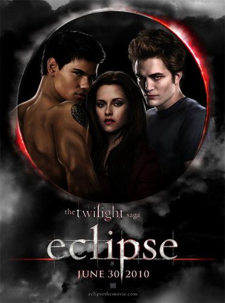

<br> </br>

##### Within the past few years, there have been efforts to acknowledge and address the lack of diversity in Hollywood, the most notable of which started after the announcement of Oscars nominations for the 2016 awards with the hashtag “#OscarsSoWhite”. 

##### 	“#OscarsSoWhite refers to all marginalized communities and is not about quotas but about asking inclusive questions when staffing films—from the actors cast to the boom operators and craft-services teams hired. It is about operating outside of the same networks that have been used for years and instead providing opportunities to talented craftspeople from groups not usually included.” (Reign, April. Vanity Fair 2018) 

##### Even though the 2018 Oscars saw more wins for movies made by and about people of color (Get Out, Coco, The Shape of Water),  there is still a lack of overall diversity amongst Hollywood actors, and whitewashing continues to be a prevalent issue in films portraying people of color. In this project, we are focusing on the production teams behind the highest and lowest rated movies in IMDB to visualize who is producing movies that have received high ratings and low reviews. We would like to see if movies with a higher rating tend to have more or less diversity in their production teams, or if there is any kind of pattern between the rating of a movie (in this database) and the diversity of the team. 

##### Below are the producers for the top 10 rated movies in the IMDB database. The films in this set are iconic and well-known such as Shawshank Redemption, Lord the Rings: Return of the King, and Schindler’s List, just to name a few. Do you notice anything about their producers? Based on observations and research, we found that most of the producers of these famous films tend to be white and male with few exceptions. It can also be noted that the films in this category all have reoccuring themes of violence, with primarily male leads, especially The Godfather, Pulp Fiction and The Dark Knight.
<br> </br>


<figcaption> Starting on the top left corner: Liz Glotzer, Roberts Evans, Kevin De La Noy, Francis Ford Coppola, Henry Fonda, Alberto Grimaldi, Lawrence Bender, Movie cover of Schindler's List, Peter Jackson, and Ross Grayson Bell </figcaption>

```{r, message=FALSE, warning=FALSE}
library(mdsr)
library(RMySQL)
db <- dbConnect_scidb(dbname = "imdb")

library(tidyverse)
library(ggthemes)
library(RColorBrewer)
```

 

```{r, message=FALSE, warning=FALSE}
top_10_Movies <- "
SELECT t.title, cast.note, name_cast.name, name_cast.gender
FROM title t
JOIN movie_info_idx AS mi1 ON mi1.movie_id = t.id
JOIN movie_info_idx AS mi2 ON mi2.movie_id = t.id
JOIN cast_info as cast on cast.movie_id = t.id
join name as name_cast on name_cast.id = cast.person_id
WHERE t.kind_id = 1 
  AND mi1.info_type_id = 100
  AND mi2.info_type_id = 101
  AND mi1.info > 100000
  and cast.role_id in (3, 4, 8)
  group by t.title
ORDER BY mi2.info desc
LIMIT 10;
"
db %>%
  dbGetQuery(top_10_Movies)
```
<br> </br>

##### Next, we have displayed the producers for the 10 movies in the IMDB database with the lowest ratings. These are movies that you may have heard of, but not for their great cinematography or achievements in storytelling such as The Last Airbender, which received negative reviews for its lackluster visuals and deviation from the children’s show the film was based on. We know from research that the producers of these movies (although not all pictured)  are a more diverse group than the one pictured above. Our visualization seeks to take a closer look at the production teams of the movies in these groupings and portray the varying and sometimes nonexistent diversity in the teams. 
<br> </br>




<figcaption> Starting on the top left corner: Michael Dauterive, Jeb Brody, Scott Aversano, Bill Bannerman, Drew Barrymore, Tracy Barone, James Lassiter, A movie cover of Twilight Saga: Breaking Dawn Part I, and A movie cover of Twilight Saga: Eclipse. </figcaption>


```{r, message=FALSE, warning=FALSE}
bottom_10_Movies <- 
"
SELECT t.title, cast.note, name_cast.name, name_cast.gender
FROM title t
JOIN movie_info_idx AS mi1 ON mi1.movie_id = t.id
JOIN movie_info_idx AS mi2 ON mi2.movie_id = t.id
JOIN cast_info as cast on cast.movie_id = t.id
join name as name_cast on name_cast.id = cast.person_id
WHERE t.kind_id = 1 
  AND mi1.info_type_id = 100
  AND mi2.info_type_id = 101
  AND mi1.info > 100000
  and cast.role_id in (3, 4, 8)
  group by t.title
ORDER BY mi2.info
LIMIT 10;
"
db %>%
  dbGetQuery(bottom_10_Movies)
```

```{r, message=FALSE, warning=FALSE}
all_movies = c("Shawshank Redemption", "Shawshank Redemption","Shawshank Redemption","Shawshank Redemption","Shawshank Redemption","Shawshank Redemption","The Godfather","The Godfather","The Godfather","The Godfather","The Godfather","The Godfather","The Godfather", "The Dark Knight", "The Dark Knight","The Dark Knight","The Dark Knight","The Dark Knight","The Dark Knight","The Dark Knight","The Dark Knight","The Dark Knight","The Dark Knight","The Dark Knight","The Dark Knight","The Dark Knight","The Dark Knight","The Dark Knight","The Dark Knight", "The Godfather: Part II","The Godfather: Part II","The Godfather: Part II","The Godfather: Part II","The Godfather: Part II","The Godfather: Part II","The Godfather: Part II","The Godfather: Part II","The Godfather: Part II", "12 Angry Men", "12 Angry Men", "12 Angry Men", "12 Angry Men", "12 Angry Men", "12 Angry Men", "Il buono,\n il brutto,\n il cattivo","Il buono,\n il brutto,\n il cattivo","Il buono,\n il brutto,\n il cattivo","Il buono,\n il brutto,\n il cattivo","Il buono,\n il brutto,\n il cattivo","Il buono,\n il brutto,\n il cattivo","Il buono,\n il brutto,\n il cattivo","Il buono,\n il brutto,\n il cattivo","Il buono,\n il brutto,\n il cattivo", "Pulp Fiction","Pulp Fiction","Pulp Fiction","Pulp Fiction","Pulp Fiction","Pulp Fiction","Pulp Fiction","Pulp Fiction","Pulp Fiction","Pulp Fiction","Pulp Fiction", "Schindler's List","Schindler's List","Schindler's List","Schindler's List","Schindler's List","Schindler's List","Schindler's List","Schindler's List","Schindler's List","Schindler's List", "The Lord of the Rings:\nThe Return of the King","The Lord of the Rings:\nThe Return of the King","The Lord of the Rings:\nThe Return of the King","The Lord of the Rings:\nThe Return of the King","The Lord of the Rings:\nThe Return of the King","The Lord of the Rings:\nThe Return of the King","The Lord of the Rings:\nThe Return of the King","The Lord of the Rings:\nThe Return of the King","The Lord of the Rings:\nThe Return of the King","The Lord of the Rings:\nThe Return of the King","The Lord of the Rings:\nThe Return of the King","The Lord of the Rings:\nThe Return of the King","The Lord of the Rings:\nThe Return of the King","The Lord of the Rings:\nThe Return of the King","The Lord of the Rings:\nThe Return of the King", "Fight Club","Fight Club","Fight Club","Fight Club","Fight Club","Fight Club","Fight Club","Fight Club")

all_roles = c("executive producer", "executive producer", "producer", "screenplay","story by", "director", "executive producer", "associate producer", "producer", "screenplay", "story by", "screenplay", "director", "executive producer", "associate producer", "line producer: Hong Kong", "executive producer", "producer", "producer", "producer", "producer", "executive producer", "executive producer", "story by", "characters", "screenplay", "story by", "screenplay", "director", "producer", "executive producer", "co-producer", "co-producer", "associate producer", "screenplay", "story by", "screenplay", "director", "producer", "associate producer", "producer", "screenplay", "story by", "director", "producer", "screenplay", "English version", "screenplay", "story by", "screenplay", "screenplay", "story by", "director", "producer", "executive producer", "co-executive producer", "executive producer", "executive producer", "co-executive producer", "co-executive producer", "story by", "story by", "written by", "director", "associate producer", "executive producer", "producer", "producer", "associate producer", "co-producer", "producer", "story by", "screenplay", "director", "producer", "executive producer", "executive producer", "producer", "co-producer", "co-producer", "executive producer", "producer", "executive producer", "executive producer", "screenplay", "screenplay", "story by", "screenplay", "director", "producer", "producer", "associate producer", "producer", "executive producer", "story by", "screenplay", "director")

all_people = c("Liz Glotzer", "David Lester", "Niki Marvin", "Frank Darbont", "Stephen King", "Frank Darabont", "Robert Evans", "Gray Frederickson", "Albert Ruddy", "Francis Ford Coppola", "Mario Puzo", "Mario Puzo", "Francis Ford Coppola", "Kevin De La Noy", "Jordan Goldberg", "Philip Lee", "Benjamin Melniker", "Christopher Nolan", "Lorne Orleans", "Charles Roven", "Emma Thomas", "Thomas Tull", "Michael Uslan", "David Goyer", "Bob Kane", "Christopher Nolan", "Christopher Nolan", "Jonathan Nolan", "Christopher Nolan", "Francis Ford Coppola", "Robert Evans", "Gray Frederickson", "Fred Roos", "Mona Skager", "Francis Ford Coppola", "Mario Puzo", "Mario Puzo", "Francis Ford Coppola", "Henry Fonda", "George Justin", "Reginald Rose", "Reginald Rose", "Reginald Rose", "Sidney Lumen", "Alberto Grimaldi", "Agenore Incrocci", "Mickey Knox", "Sergio Leone", "Sergio Leone", "Furio Scarpelli", "Luciano Vincenzoni", "Luciano Vincenzoni", "Sergio Leone", "Lawrence Bender", "Danny DeVito", "Richard Gladstein", "Michael Shamberg", "Stacey Sher", "Bob Weinstein", "Harvey Weinstein", "Roger Avary", "Quentin Tarantino", "Quentin Tarantino", "Quentin Tarantino", "Irving Glovin", "Kathleen Kennedy", "Branko Lustig", "Gerald Molen", "Robert Raymond", "Lew Rywin", "Steven Spielberg", "Thomas Keneally", "Steven Zaillian", "Steven Spielberg", "Peter Jackson", "Michael Lynne", "Mark Ordesky", "Barrie Osborne", "Rick Porras", "Jamie Selkirk", "Robert Shaye", "Fran Walsh", "Bob Weinstein", "Harvey Weinstein", "Philippa Boyens", "Peter Jackson", "J.R.R. Tolkien", "Fran Walsh", "Peter Jackson", "Ross Grayson Bell", "Cean Chaffin", "John Dorsey", "Art Linson", "Arnon Milchan", "Chuck Palahniuk", "Jim Uhls", "David Fincher")

race = c("white", "white", "white", "white", "white", "white", "white", "white", "white", "white", "white", "white", "white", "white", "white", "asian", "white", "white", "white", "white", "white", "white", "white", "white", "white", "white", "white", "white", "white", "white", "white", "white", "white", "white", "white", "white", "white","white", "white", "white", "white", "white", "white", "white", "white", "white", "white", "white", "white", "white", "white", "white", "white", "white", "white", "white", "white", "white", "white", "white", "white","white", "white", "white", "white", "white", "white", "white", "white", "white", "white", "white", "white", "white", "white", "white", "white", "white", "latino", "white", "white", "white", "white", "white", "white", "white", "white", "white", "white", "white", "white", "white", "white", "white", "white", "white", "white")

gender = c("female", "male", "female", "male", "male", "male", "male", "male", "male", "male", "male", "male", "male", "male", "male", "male", "male", "male", "male", "male", "female", "male", "male", "male", "male", "male", "male", "male", "male", "male", "male", "male", "male", "female", "male", "male", "male", "male", "male", "male", "male", "male", "male", "male", "male", "male", "male", "male", "male", "male", "male", "male", "male", "male", "male", "male", "male", "female", "male", "male", "male", "male", "male", "male", "male", "female", "male", "male", "male", "male", "male", "male", "male", "male", "male", "male", "male", "male", "male", "male", "male", "female", "male", "male", "female", "male", "male", "female", "male", "male", "female", "male", "male", "male", "male", "male", "male")

# making the big dataframe with all the movies from the top 10
all_things = data_frame(all_movies, all_roles, all_people, race, gender)
```

```{r, message=FALSE, warning=FALSE, echo=FALSE, fig.width= 30, fig.height= 25}
# graph showing the race and gender of each top 10 movie separately
sorted_by_film <- ggplot(all_things, aes(x = gender, y = race, fill = race)) +
  geom_bin2d() + facet_wrap(~all_movies) + theme_gray() +
  scale_fill_manual(values=c(white="#fbf7f5", asian="blue", latino = "orange")) + xlab("Gender") + 
    ylab("Race") +
  theme(axis.text.x = element_text(angle = 70, hjust = 1)) +
  theme(axis.title.x = element_text(size = 50)) +
  theme(axis.title.y = element_text(size = 40)) +
  theme(axis.text.x = element_text(size = rel(5))) + 
  theme(axis.text.y = element_text(size = rel(5))) +
  theme(strip.text.x = element_text(size = 40)) +
  theme(legend.title = element_text(color = "black", size = 50, face = "bold")) + 
  theme(legend.text = element_text(color = "black", size = 40)) + 
  guides(fill = guide_legend(keywidth = 3, 
                             keyheight = 3, 
                             title = "Race")) +
  theme(legend.background = element_rect(fill = "lightblue", 
                                         size = 0.5, linetype = "solid", 
                                         color = "darkblue")) + 
  ggtitle("Figure 1: Top 10 Rated Movies") +
  theme(plot.title = element_text(size = 40, face = "bold"))

sorted_by_film

# making the graph showing the diversity of the crew in the top 10 movies
sorted_by_role <- ggplot(all_things, aes(x = race, fill = race, label = "height")) +
  geom_bar() +
  facet_wrap(~all_roles) + 
  theme_gray() + 
  scale_fill_manual(values=c(white="#fbf7f5", asian="blue", latino = "orange")) + 
  xlab("Race") +
  theme(axis.text.x = element_text(angle = 70, hjust = 1)) +
  theme(axis.title.x = element_text(size = 50)) +
  theme(axis.title.y = element_text(size = 40)) +
  theme(axis.text.x = element_text(size = rel(5))) + 
  theme(axis.text.y = element_text(size = rel(5))) +
  theme(strip.text.x = element_text(size = 40)) +
  theme(legend.title = element_text(color = "black", size = 50, face = "bold")) + 
  theme(legend.text = element_text(color = "black", size = 40)) + 
  guides(fill = guide_legend(keywidth = 3, 
                             keyheight = 3, 
                             title = "Race")) +
  theme(legend.background = element_rect(fill = "lightblue", 
                                         size = 0.5, linetype = "solid", 
                                         color = "darkblue")) + 
  ggtitle("Figure 2: Top 10 Rated Movies: Diversity in Production Teams") + 
  theme(plot.title = element_text(size = 40, face = "bold"))+
  geom_text(stat = 'count', aes(label = ..count..), size = 10, vjust = -.1)

sorted_by_role
```

<br> </br>

##### Figure 1 looks at the the top 10 rated movies in the database and graphs the race and gender of their production teams. We can see that with only two exceptions, the majority of the teams tend to be white. In Figure 2, we take a closer look into who is filling the production roles for the top ten movies. We see that the majority of Executive Producers, who are responsible for the other members of the production team are entirely white. In this figure,we see some diversity in the role of Co-Producer, and the role of Line Producer. In this instance, however, it can be noted that the role of Line Producer is specific to the Hong Kong location (the dataframe shows that this role was for the movie The Last Airbender) 


```{r, warning=FALSE, message=FALSE}
all_titles = c("Batman and Robin", "Batman and Robin", "Batman and Robin", "Batman and Robin", "Batman and Robin", "Batman and Robin", "Batman and Robin", "Batman and Robin", "Fifty Shades\nof Grey", "Fifty Shades\nof Grey", "Fifty Shades\nof Grey", "Fifty Shades\nof Grey", "Fifty Shades\nof Grey", "Fifty Shades\nof Grey", "Fifty Shades\nof Grey", "Fifty Shades\nof Grey","The Last Airbender", "The Last Airbender", "The Last Airbender", "The Last Airbender", "The Last Airbender", "The Last Airbender", "The Last Airbender" , "The Last Airbender", "The Last Airbender", "The Last Airbender", "The Last Airbender", "The Last Airbender", "The Last Airbender", "The Last Airbender" , "The Last Airbender","The Twilight Saga:\n New Moon", "The Twilight Saga:\n New Moon", "The Twilight Saga:\n New Moon", "The Twilight Saga:\n New Moon", "The Twilight Saga:\n New Moon", "The Twilight Saga:\n New Moon", "The Twilight Saga:\n New Moon", "The Twilight Saga:\n New Moon", "The Twilight Saga:\n New Moon", "The Twilight Saga:\n New Moon", "The Twilight Saga:\n New Moon", "The Twilight Saga:\n New Moon", "The Twilight Saga:\n New Moon","AVPR\n Aliens vs Predator\nRequiem",  "AVPR\n Aliens vs Predator\nRequiem", "AVPR\n Aliens vs Predator\nRequiem", "AVPR\n Aliens vs Predator\nRequiem", "AVPR\n Aliens vs Predator\nRequiem",  "AVPR\n Aliens vs Predator\nRequiem", "AVPR\n Aliens vs Predator\nRequiem", "AVPR\n Aliens vs Predator\nRequiem", "AVPR\n Aliens vs Predator\nRequiem", "AVPR\n Aliens vs Predator\nRequiem", "AVPR\n Aliens vs Predator\nRequiem", "AVPR\n Aliens vs Predator\nRequiem","Charlie's Angels:\n Full Throttle", "Charlie's Angels:\n Full Throttle", "Charlie's Angels:\n Full Throttle", "Charlie's Angels:\n Full Throttle","Charlie's Angels:\n Full Throttle", "Charlie's Angels:\n Full Throttle", "Charlie's Angels:\n Full Throttle", "Charlie's Angels:\n Full Throttle", "Charlie's Angels:\n Full Throttle", "Charlie's Angels:\n Full Throttle", "Charlie's Angels:\n Full Throttle", "Charlie's Angels:\n Full Throttle", "Charlie's Angels:\n Full Throttle", "Charlie's Angels:\n Full Throttle",  "Wild Wild West", "Wild Wild West", "Wild Wild West", "Wild Wild West",  "Wild Wild West", "Wild Wild West", "Wild Wild West", "Wild Wild West", "Wild Wild West", "Wild Wild West", "Wild Wild West", "Wild Wild West", "Wild Wild West", "Wild Wild West", "Wild Wild West", "Wild Wild West", "Wild Wild West", "Wild Wild West", "Wild Wild West", "After Earth", "After Earth", "After Earth", "After Earth", "After Earth", "After Earth", "After Earth", "After Earth", "After Earth", "After Earth", "After Earth", "After Earth", "After Earth", "The Twilight Saga:\nBreaking Dawn\nPart 1", "The Twilight Saga:\nBreaking Dawn\nPart 1","The Twilight Saga:\nBreaking Dawn\nPart 1","The Twilight Saga:\nBreaking Dawn\nPart 1","The Twilight Saga:\nBreaking Dawn\nPart 1","The Twilight Saga:\nBreaking Dawn\nPart 1","The Twilight Saga:\nBreaking Dawn\nPart 1","The Twilight Saga:\nBreaking Dawn\nPart 1","The Twilight Saga:\nBreaking Dawn\nPart 1","The Twilight Saga:\nBreaking Dawn\nPart 1","The Twilight Saga:\nBreaking Dawn\nPart 1","The Twilight Saga:\nBreaking Dawn\nPart 1","The Twilight Saga:\nBreaking Dawn\nPart 1","The Twilight Saga:\nBreaking Dawn\nPart 1","The Twilight Saga:\nBreaking Dawn\nPart 1", "The Twilight Saga:\nEclipse","The Twilight Saga:\nEclipse","The Twilight Saga:\nEclipse","The Twilight Saga:\nEclipse","The Twilight Saga:\nEclipse","The Twilight Saga:\nEclipse","The Twilight Saga:\nEclipse","The Twilight Saga:\nEclipse","The Twilight Saga:\nEclipse","The Twilight Saga:\nEclipse","The Twilight Saga:\nEclipse")

all_roles_bottom_10 = c("associate producer", "co-producer", "producer", "executive producer", "executive producer", "written by", "characters", "director","executive producer", "producer", "producer", "producer", "executive producer", "novel", "screenplay", "director","executive producer", "line producer", "executive producer", "executive producer", "executive producer", "producer", "producer", "producer", "line producer", "co-producer", "producer", "producer", "line producer", "written by", "director","co-producer", "executive producer", "line producer", "producer", "co-producer", "executive producer", "executive producer", "executive producer", "associate producer", "producer", "novel", "screenplay", "director", "executive producer", "producer", "executive producer", "producer", "producer", "characters", "written by", "characters", "characters","characters", "characters", "characters","producer", "executive producer", "associate producer", "producer", "producer", "associate producer", "executive producer", "screenplay", "story", "television series", "television series", "screenplay", "screenplay", "director","executive producer", "executive producer" , "executive producer", "executive producer", "co-producer", "producer", "co-producer", "executive producer", "associate producer", "producer", "associate producer", "executive producer", "screenplay", "screenplay", "screenplay", "story", "story", "screenplay", "director", "producer", "associate producer", "producer", "producer", "co-producer", "co-producer", "producer", "producer", "executive producer", "screenplay", "story", "screenplay", "director", "associate producer", "co-producer", "executive producer", "producer", "associate producer", "producer", "executive producer", "executive producer", "executive producer", "producer", "producer", "producer", "story", "screenplay", "director","co-producer", "executive producer", "producer", "associate producer", "executive producer", "executive producer", "executive producer", "producer", "story", "screenplay", "director")

all_names = c("Dauterive, Mitchell E.", "Elvin, William M.", "Macgregor-Scott, Peter", "Melniker, Benjamin", "Uslan, Michael E.", "Goldsman, Akiva", "Kane, Bob", "Schumacher, Joel","Brody, Jeb", "Brunetti, Dana", "De Luca, Michael", "James, E.L.", "Viscidi, Marcus", "James, E.L.", "Marcel, Kelly", "Taylor-Johnson, Sam", "Aversano, Scott", "Avery, Brad", "DiMartino, Michael Dante", "Kennedy, Kathleen", "Konietzko, Bryan", "Marshall, Frank", "Mercer, Sam", "Ngoc, Tran Thi Bich", "Overgaard, Mouns", "Rodriguez, Jose L.", "Shyamalan, M. Night", "Tran, Chanh", "Weber, Iris", "Shyamalan, M. Night", "Shyamalan, M. Night","Bannerman, Bill", "Bowen, Marty", "Cerasuolo, Guido", "Godfrey, Wyck", "Kohansky-Roberts, Kerry", "Mooradian, Greg", "Morgan, Mark", "Oseary, Guy", "Roker, David", "Rosenfelt, Karen", "Meyer, Stephenie", "Rosenberg, Melissa", "Weitz, Chris", "Brenner, Robbie", "Davis, John", "Deason, Paul", "Giler, David", "Hill, Walter", "O'Bannon, Dan", "Salerno, Shane", "Shusett, Ronald", "Thomas, Jim", "Thomas, John", "Strause, Colin", "Strause, Greg", "Barrymore, Drew", "Crowley, Patrick", "Goldberg, Amanda", "Goldberg, Leonard", "Juvonen, Nancy","Savage, Stephanie", "Topping, Jenno", "August, John", "August, John", "Goff, Ivan", "Roberts, Ben", "Wibberley, Cormac", "Wibberley, Marianne", "McG","Barone, Tracy", "Glaser, Tracy", "Josephson, Barry", "LeMasters, Kim", "Lodato, Doug", "Peters, Jon", "Place, Graham", "Simon, Joel", "Soldo, Chris", "Sonnenfeld, Barry", "Tannenbaum, Neri Kyle", "Todman Jr., Bill", "Maddock, Brent", "Price, Jeffrey", "Seaman, Peter S.", "Thomas, Jim", "Thomas, John", "Wilson, S.S.", "Sonnenfeld, Barry","James Lassiter", "Kwame Parker", "Jada Pinkett Smith", "Caleeb Pinkett", "Ashwin Rajan", "John Rusk", "M. Night Shyamalan", "Will Smith", "E. Bennett Walsh", "M. Night Shyamalan", "Will Smith", "Gary Whitta", "M. Night Shyamalan","Roberto Bakker", "Bill Bannerman", "Marty Bowen", "Wyck Godfrey", "Barbara Kelly", "Stephenie Meyer", "Greg Mooradian", "Mark Morgan", "Guy Oseary", "Carlos Paiva", "Karen Rosenfelt", "Isabelle Tanugi", "Stephenie Meyer", "Mel Rosenberg", "Bill Condon","Bill Bannerman", "Marty Bowen", "Wyck Godfrey", "Isaac Klausner", "Greg Mooradian", "Mark Morgan", "Guy Oseary", "Karen Rosenfelt", "Stephenie Meyer", "Melissa Rosenberg", "David Slade")

all_race = c("white", "white", "white", "white", "white", "white", "white", "white","white", "white", "white", "white", "white", "white", "white", "white", "white", "white", "white", "white", "white", "white", "white", "asian", "white", "latino", "asian", "asian", "white", "asian", "asian", "white", "white", "white", "white", "white", "white", "white", "middle_eastern", "white", "white", "white", "white", "white","white", "white", "white", "white", "white", "white", "white", "white", "white", "white", "white", "white","white", "white", "white", "white", "white", "white", "white", "white", "white", "white", "white", "white", "white", "white","white", "white", "white", "white", "white", "white", "white", "white", "white", "white", "white", "white", "white", "white", "white", "white", "white", "white", "white", "black", "black", "black", "black", "asian", "white", "asian", "black", "white","asian","black", "white","asian","white", "white", "white", "white", "white", "white", "white", "white", "middle_eastern", "latino","white", "white", "white", "white","white", "white", "white", "white", "white", "white", "white", "middle_eastern", "white", "white", "white", "white")

all_gender = c("male", "male", "male", "male", "male", "male", "male", "male", "male", "male", "male", "female", "male", "female", "female", "female","male", "male", "male", "female", "male", "male", "male", "male", "male", "male","male", "male", "female", "male", "male","male", "male", "male", "male", "female", "male", "male", "male", "male", "female", "female", "female", "male","female", "male", "male", "male", "male", "male", "male", "male", "male", "male", "male", "male","female", "male", "female", "male", "female", "female", "female", "male", "male", "male", "male", "male", "female", "male","female", "female", "male", "male", "male", "male", "male", "male", "male", "male", "female", "male", "male", "male", "male", "male", "male", "male", "male", "male", "male", "female", "male", "male", "male", "male", "male", "male", "male", "male", "male", "male", "male", "male", "male", "male", "female", "female", "male","male", "male", "male", "female", "female", "female", "male", "male","male", "male", "male", "male", "male", "male", "male", "female", "female", "female", "female")

#making that bigass dataframe!!! 
final_bottom10_df = data_frame(all_titles, all_roles_bottom_10, all_names, all_race, all_gender)
```

```{r, message=FALSE, warning=FALSE, echo=FALSE, fig.width= 30, fig.height= 25}
# making graph for bottom 10 movies showing race and gender distribution in each movie
sorted_by_film_bottom_10 <- ggplot(final_bottom10_df, aes(x = all_gender, y = all_race, fill = all_race)) +
  geom_bin2d() + facet_wrap(~all_titles) + theme_gray() +
  scale_fill_manual(values=c(white="#fbf7f5", asian="blue", latino = "orange", black = "saddlebrown", middle_eastern = "green")) +
  theme(axis.title.x = element_text(size = 50)) +
  theme(axis.title.y = element_text(size = 50)) +
  theme(axis.text.x = element_text(size = rel(5))) +
  theme(axis.text.y = element_text(size = rel(5))) +
  theme(strip.text.x = element_text(size = 40)) +
  theme(legend.title = element_text(color = "black", size = 50, face = "bold")) +
  theme(legend.text = element_text(color = "black", size = 40)) +
  guides(fill = guide_legend(keywidth = 3,
                             keyheight = 3,
                             title = "Race")) +
  theme(legend.background = element_rect(fill = "lightblue",
                                         size = 0.5, linetype = "solid",
                                         color = "darkblue")) +
  ggtitle("Figure 3: 10 Lowest Rated Movies - Production Teams") +
  theme(plot.title = element_text(size = 40, face = "bold")) +
  xlab("Gender") +
  ylab("Race")

sorted_by_film_bottom_10

# making a graph showing the diversity of the crew of the bottom 10 movies
sorted_by_role_bottom_10 <- ggplot(final_bottom10_df, aes(x = all_race, fill = all_race)) + 
  geom_bar() + facet_wrap(~ all_roles_bottom_10) + theme_gray() + scale_fill_manual(values=c(white="#fbf7f5", asian="blue", latino = "orange", black = "saddlebrown", middle_eastern = "green")) + 
  theme(axis.text.x = element_text(angle = 70, hjust = 1)) +
  xlab("Race") +
  theme(axis.title.x = element_text(size = 50)) +
  theme(axis.title.y = element_text(size = 40)) +
  theme(axis.text.x = element_text(size = rel(5))) + 
  theme(axis.text.y = element_text(size = rel(5))) +
  theme(strip.text.x = element_text(size = 40)) +
  theme(legend.title = element_text(color = "black", size = 50, face = "bold")) + 
  theme(legend.text = element_text(color = "black", size = 40)) + 
  guides(fill = guide_legend(keywidth = 3, 
                             keyheight = 3, 
                             title = "Race")) +
  theme(legend.background = element_rect(fill = "lightblue", 
                                         size = 0.5, linetype = "solid", 
                                         color = "darkblue")) + 
  ggtitle("Figure 4: Diversity in Production Teams by Role") + 
  theme(plot.title = element_text(size = 40, face = "bold"))  +
  geom_text(stat = 'count', aes(label = ..count..), size = 10, vjust = -.1)

sorted_by_role_bottom_10
```


##### We then take a look at the 10 Lowest Rated Movies and their production teams in Figure 3. When compared to the visualization of the Top 10 Rated Movies, we can see the obvious increase in diversity. Even though this set of movies and production teams is more representative of communities of color, with the exception of After Earth, we notice that there is little representation for women of color in the production teams of these movies. The last figure (Figure 4) once again shows an overall representation of production roles for both the top ten and bottom ten movies in the database with an added count of the races of people who have filled those roles. 

##### These visualizations are meant to show the lack of diversity in Hollywood production teams. The data, however is not truly representative of all of Hollywood since we pulled an analyzed only the movies with high and low ratings from the database. Even though this visualization may suggest otherwise, the diversity in Hollywood movies in increasing not only amongst actors and performers, but amongst directors, and producers as well. There many producers, directors and creatives of color who are continuing to diversity the film production landscape and tell the narratives of people of color, even though they are not represented in this particular subset of the IMDB data. 


^[https://github.com/lolabfr/miniProject4.git]


